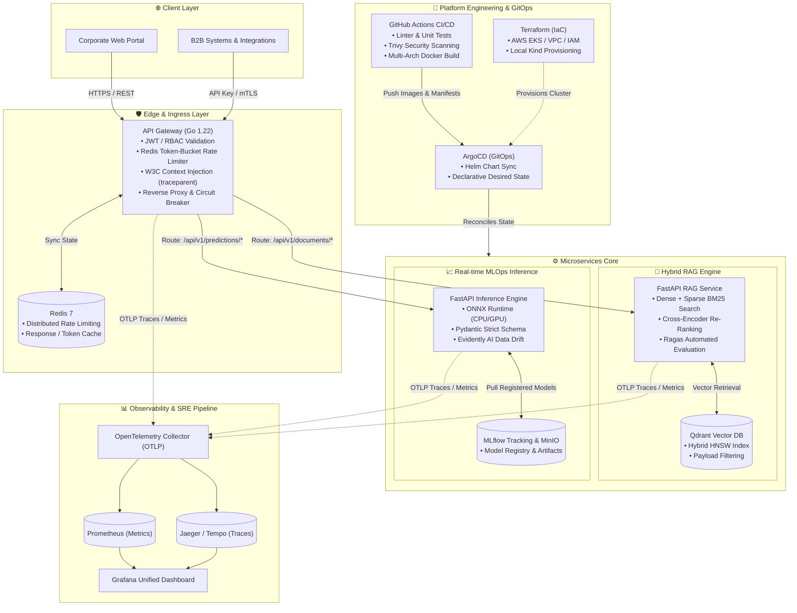
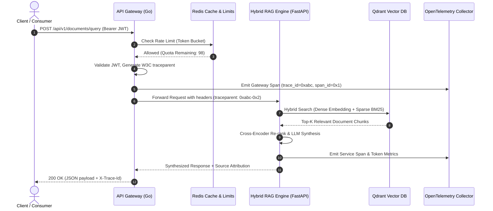

# 🏛️ Enterprise AI & MLOps Platform

[](#-cicd--devops)
[](#-services-breakdown)
[](#-services-breakdown)
[](#-kubernetes--gitops)
[](#-infrastructure-as-code)
[](#-hybrid-rag-engine)
[](#-observability--sre)
[](LICENSE)

> **Industrial-grade, distributed corporate platform combining High-Concurrency Microservices (Go), Production-grade Hybrid RAG (FastAPI + Qdrant), Low-Latency MLOps Inference (ONNX + MLflow), and End-to-End Observability (OpenTelemetry, Prometheus, Grafana, Jaeger) orchestrated via GitOps (ArgoCD & Kubernetes).**

---

## 📑 Table of Contents

- [Overview & Business Case](#-overview--business-case)
- [System Architecture](#-system-architecture)
- [Distributed Request & Telemetry Lifecycle](#-distributed-request--telemetry-lifecycle)
- [Repository Structure](#-repository-structure)
- [Services Breakdown](#-services-breakdown)
  - [1. API Gateway (Go)](#1-api-gateway-go)
  - [2. Hybrid RAG Engine (FastAPI + Qdrant)](#2-hybrid-rag-engine-fastapi--qdrant)
  - [3. MLOps Inference Service (FastAPI + ONNX Runtime)](#3-mlops-inference-service-fastapi--onnx-runtime)
- [Observability & SRE](#-observability--sre)
- [Kubernetes & GitOps](#-kubernetes--gitops)
- [Infrastructure as Code (Terraform)](#-infrastructure-as-code-terraform)
- [CI/CD Pipeline & DevSecOps](#-cicd-pipeline--devsecops)
- [Quickstart (Local Environment)](#-quickstart-local-environment)
- [Architecture Decision Records (ADRs)](#-architecture-decision-records-adrs)
- [Roadmap](#-roadmap)
- [License](#-license)

---

## 🎯 Overview & Business Case

Modern enterprise AI initiatives fail when models are siloed in Jupyter notebooks without resilient backend routing, auditability, rate limiting, and zero-downtime deployment pipelines.

This platform implements a unified **Corporate Intelligent Risk & Document Engine**:
1. **Unstructured Knowledge Discovery**: Corporate policy, compliance documents, and contracts queried via **Hybrid RAG** (Dense Vector embeddings + Sparse BM25 retrieval with Cross-Encoder re-ranking), backed by automated semantic evaluation (**Ragas**).
2. **Real-Time Predictive Analytics**: Structured risk and credit scoring executed via an **ONNX Runtime** inference microservice with automated data validation, low latency (<5ms model execution), and **MLflow** model version lineage.
3. **Enterprise Edge Security**: A **Go-based API Gateway** enforces JWT/OAuth2 verification, distributed token-bucket rate limiting via Redis, and distributed W3C `traceparent` propagation across the entire microservices network.
4. **Cloud-Native Resilience**: Fully packaged with **Docker Compose**, **Kubernetes (Helm / Kustomize)**, **ArgoCD GitOps**, and **Terraform** for reproducible infrastructure on AWS EKS or local Kind clusters.

---

## 🏛 System Architecture

The following diagram illustrates the data plane, control plane, telemetry pipeline, and infrastructure lifecycle:



---

## 🔄 Distributed Request & Telemetry Lifecycle



---

## 📁 Repository Structure

```plaintext
enterprise-ai-platform/
├── .github/
│   └── workflows/
│       ├── ci-gateway.yml             # Go linting, unit tests, and container build
│       ├── ci-rag.yml                 # Python testing (pytest), Ragas evaluation, container build
│       ├── ci-mlops.yml               # ML model validation, tests, container build
│       └── security-scan.yml          # Trivy vulnerability scans & secret detection
├── terraform/                         # Infrastructure as Code
│   ├── environments/
│   │   ├── local/                     # Kind cluster setup + local providers
│   │   └── prod-eks/                  # AWS VPC, EKS Cluster, IAM, OIDC, NodeGroups
│   ├── modules/
│   │   ├── networking/
│   │   └── kubernetes-cluster/
│   └── main.tf
├── k8s/                               # Cloud-Native Manifests & GitOps
│   ├── base/                          # Common configs, namespaces, network policies
│   ├── apps/
│   │   ├── api-gateway/               # Deployment, Service, HPA, ConfigMap
│   │   ├── hybrid-rag/                # Deployment, SecretProviderClass, HPA
│   │   └── mlops-inference/           # Deployment, Resource limits, HPA
│   └── gitops/
│       └── argocd-root-app.yaml       # ArgoCD App-of-Apps root pattern
├── services/
│   ├── api-gateway/                   # [Go 1.22]
│   │   ├── cmd/api/main.go            # Entrypoint
│   │   ├── internal/auth/             # JWT & RBAC Middleware
│   │   ├── internal/limiter/          # Redis Token Bucket Limiter
│   │   ├── internal/proxy/            # Reverse Proxy & Tracing Injector
│   │   ├── Dockerfile
│   │   └── go.mod
│   ├── hybrid-rag-engine/             # [Python 3.11]
│   │   ├── src/
│   │   │   ├── api/routes.py          # FastAPI Endpoints
│   │   │   ├── core/retrieval.py      # Qdrant Hybrid Search (Dense + Sparse)
│   │   │   ├── core/reranker.py       # Cross-Encoder Re-ranking
│   │   │   └── eval/ragas_eval.py     # Automated evaluation pipeline
│   │   ├── tests/
│   │   ├── Dockerfile
│   │   └── pyproject.toml
│   └── mlops-inference/               # [Python 3.11]
│       ├── src/
│       │   ├── api/routes.py          # Real-time scoring endpoint
│       │   ├── engine/onnx_runner.py  # High-throughput ONNX Runtime executor
│       │   └── monitoring/drift.py    # Evidently Data Drift verification
│       ├── model/                     # Exported .onnx models & metadata
│       ├── Dockerfile
│       └── pyproject.toml
├── monitoring/                        # SRE & Observability Stack
│   ├── otel-collector-config.yaml     # OTLP receivers, processors, and exporters
│   ├── prometheus/
│   │   └── prometheus.yml             # Scrape configs & alert rules
│   └── grafana/
│       ├── provisioning/
│       └── dashboards/                # Pre-built dashboards (RPS, P99 Latency, Tokens)
├── docs/
│   ├── adr/                           # Architectural Decision Records
│   │   ├── 0001-monorepo-strategy.md
│   │   ├── 0002-api-gateway-in-go.md
│   │   ├── 0003-qdrant-for-hybrid-search.md
│   │   └── 0004-onnx-runtime-for-mlops.md
│   └── api/                           # OpenAPI (Swagger) specifications
├── docker-compose.yml                 # Single-command full-stack local environment
├── Makefile                           # Developer CLI automation
└── README.md                          # Platform documentation
```

---

## 🔧 Services Breakdown

### 1. API Gateway (Go)
- **Role**: High-concurrency reverse proxy, edge authentication, rate limiting, and distributed tracing initiator.
- **Tech Stack**: Go 1.22, Gin/Chi, `go-redis`, OpenTelemetry Go SDK.
- **Key Features**:
  - Sub-millisecond routing overhead.
  - Redis-backed distributed token bucket algorithm to prevent DoS and enforce tier limits.
  - Automatic injection of W3C `traceparent` headers to downstream Python services.

### 2. Hybrid RAG Engine (FastAPI + Qdrant)
- **Role**: Enterprise document retrieval, context fusion, and factual response generation.
- **Tech Stack**: Python 3.11, FastAPI, Qdrant Client, FastEmbed / Sentence-Transformers, Ragas.
- **Key Features**:
  - **Hybrid Search**: Fuses Dense semantic vectors (cosmic distance) with Sparse BM25 tokens for acronyms and specific clauses.
  - **Re-ranking**: Second-stage Cross-Encoder filters irrelevant context to minimize LLM hallucination and token cost.
  - **Evaluation Suite**: Integrated Ragas tests assessing *faithfulness*, *answer relevancy*, and *context precision*.

### 3. MLOps Inference Service (FastAPI + ONNX Runtime)
- **Role**: Ultra-low-latency real-time scoring and classification.
- **Tech Stack**: Python 3.11, ONNX Runtime, MLflow Tracking, Evidently AI.
- **Key Features**:
  - **ONNX Optimization**: Converted models run with hardware-accelerated thread pooling, reducing inference latency by up to 5x compared to raw PyTorch/Scikit-learn.
  - **Model Lineage**: Direct integration with MLflow Model Registry for version-controlled deployment.
  - **Data Drift Detection**: Real-time evaluation of feature drift using Kolmogorov-Smirnov statistical tests.

---

## 📊 Observability & SRE

The platform incorporates **Google SRE Golden Signals** (Latency, Traffic, Errors, Saturation):
1. **OpenTelemetry Collector**: Ingests OTLP spans and metrics over gRPC (port `4317`) and HTTP (port `4318`).
2. **Prometheus**: Scrapes operational metrics, container health, and custom service metrics (`http_requests_total`, `inference_duration_seconds`, `llm_tokens_generated`).
3. **Jaeger / Tempo**: End-to-end distributed trace waterfall across Gateway ➔ RAG ➔ Qdrant.
4. **Grafana Dashboards**: Unified view with pre-provisioned data sources and alert configurations.

---

## ☸️ Kubernetes & GitOps

All services are packaged for Kubernetes with cloud-native best practices:
- **Zero-Downtime Deployments**: Configured with `readinessProbe`, `livenessProbe`, and `startupProbe`.
- **Horizontal Pod Autoscaling (HPA)**: Scaled dynamically based on CPU, memory, and custom Prometheus metrics.
- **ArgoCD GitOps**: Implements the **App-of-Apps** pattern. Changing a Helm value or image tag in the Git repository automatically reconciles the cluster to the desired state.

---

## 🏗 Infrastructure as Code (Terraform)

Infrastructure is managed deterministically with modular Terraform scripts:
- **Local Environment (`terraform/environments/local`)**: Provisons a Multi-Node [Kind](https://kind.sigs.k8s.io/) cluster with ingress controllers and local registry mirrors.
- **Production Environment (`terraform/environments/prod-eks`)**: Provisons AWS VPC, Subnets across 3 AZs, EKS Control Plane (Kubernetes 1.30+), Managed Node Groups with autoscaling, and AWS IAM Roles for Service Accounts (IRSA).

---

## 🔒 CI/CD Pipeline & DevSecOps

Automated workflows ensure zero regressions and military-grade security:
1. **Linting & Code Quality**: `golangci-lint` for Go, `ruff` & `mypy` for Python.
2. **Automated Testing**: Unit and integration tests with code coverage thresholds.
3. **Vulnerability Scanning**: [Trivy](https://github.com/aquasecurity/trivy) scans Docker base images and dependencies for CVEs on every Pull Request.
4. **Secret Scanning**: Scans for leaked keys, tokens, or credentials before merge.
5. **Container Packaging**: Multi-architecture container images pushed with semantic tags.

---

## ⚡ Quickstart (Local Environment)

### Prerequisites
- [Docker](https://docs.docker.com/get-docker/) & Docker Compose v2+
- [Make](https://www.gnu.org/software/make/) (optional, but recommended)
- [Go](https://go.dev/dl/) 1.22+ and [Python](https://www.python.org/downloads/) 3.11+ (for local bare-metal development)

### 1. Clone the repository
```bash
git clone https://github.com/your-org/enterprise-ai-platform.git
cd enterprise-ai-platform
```

### 2. Launch the complete platform with one command
```bash
make up
# Or directly via Docker Compose:
docker compose up -d --build
```

### 3. Verify running services
| Service | URL / Port | Credentials / Notes |
| :--- | :--- | :--- |
| **API Gateway** | `http://localhost:8080` | Public Entrypoint |
| **Hybrid RAG Service** | `http://localhost:8001/docs` | Swagger OpenAPI UI |
| **MLOps Inference Service**| `http://localhost:8002/docs` | Swagger OpenAPI UI |
| **Qdrant Vector Dashboard** | `http://localhost:6333/dashboard` | Web GUI |
| **Grafana** | `http://localhost:3000` | User: `admin` / Pass: `admin` |
| **Prometheus** | `http://localhost:9090` | Metrics Browser |
| **Jaeger UI** | `http://localhost:16686` | Distributed Trace Waterfall |

### 4. Test an end-to-end request
```bash
# Query the Document Intelligence Engine via the Go Gateway
curl -X POST http://localhost:8080/api/v1/documents/query \
  -H "Content-Type: application/json" \
  -H "Authorization: Bearer dev-token" \
  -d '{"query": "What are the compliance guidelines for data retention?", "top_k": 3}'

# Query the MLOps Inference Engine via the Go Gateway
curl -X POST http://localhost:8080/api/v1/predictions/risk-score \
  -H "Content-Type: application/json" \
  -H "Authorization: Bearer dev-token" \
  -d '{"features": [45.2, 1.0, 320.5, 0.15, 12.0]}'
```

---

## 📐 Architecture Decision Records (ADRs)

Our technical decisions are documented through standardized ADRs in `docs/adr/`:

| ADR | Title | Status | Summary |
| :--- | :--- | :--- | :--- |
| [ADR-0001](docs/adr/0001-monorepo-strategy.md) | Monorepo Strategy for Unified Platform | **Accepted** | Enables atomic commits, cross-service tracing, and unified CI/CD. |
| [ADR-0002](docs/adr/0002-api-gateway-in-go.md) | API Gateway implemented in Go | **Accepted** | Selected for sub-millisecond concurrency, low footprint (<25MB RAM), and native Cloud-Native ecosystem integration. |
| [ADR-0003](docs/adr/0003-qdrant-for-hybrid-search.md) | Qdrant as Primary Vector Store | **Accepted** | Native support for dense + sparse payload filtering and Rust-based high-throughput indexing. |
| [ADR-0004](docs/adr/0004-onnx-runtime-for-mlops.md) | ONNX Runtime for Real-Time Inference | **Accepted** | Eliminates heavy framework dependencies (PyTorch/TensorFlow) in production containers and achieves <5ms inference. |

---

## 🗺 Roadmap

- [x] Initial Monorepo Architecture & Industrial Documentation
- [ ] Core Services Scaffold (Go Gateway, RAG FastAPI, MLOps FastAPI)
- [ ] OpenTelemetry & SRE Pipeline (OTel Collector, Prometheus, Grafana, Jaeger)
- [ ] Automated Evaluation Pipeline with Ragas & Evidently AI
- [ ] Kubernetes Manifests (Helm Charts & Kustomize)
- [ ] Terraform Modules for AWS EKS & Kind
- [ ] GitHub Actions CI/CD with Trivy Security Gate

---

## 📄 License

This project is licensed under the MIT License - see the [LICENSE](LICENSE) file for details.
